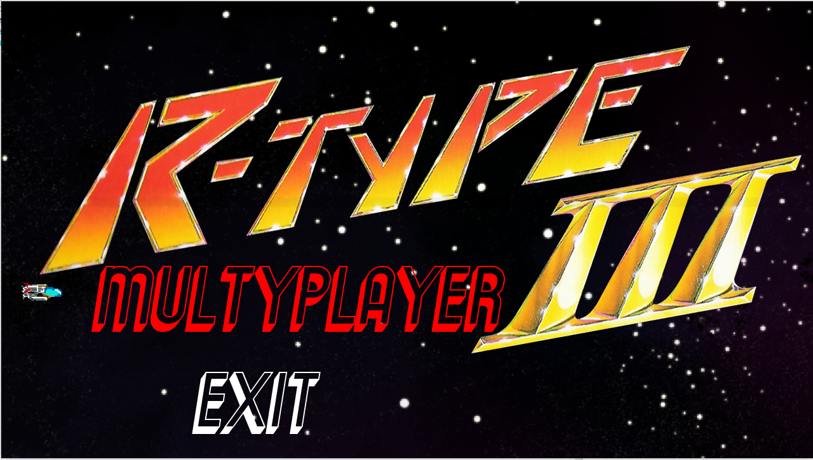
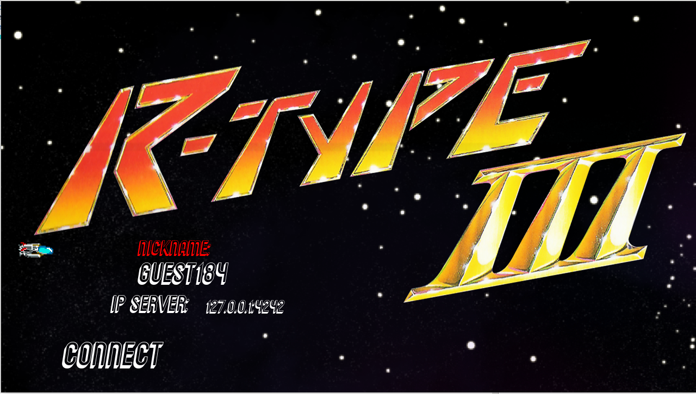
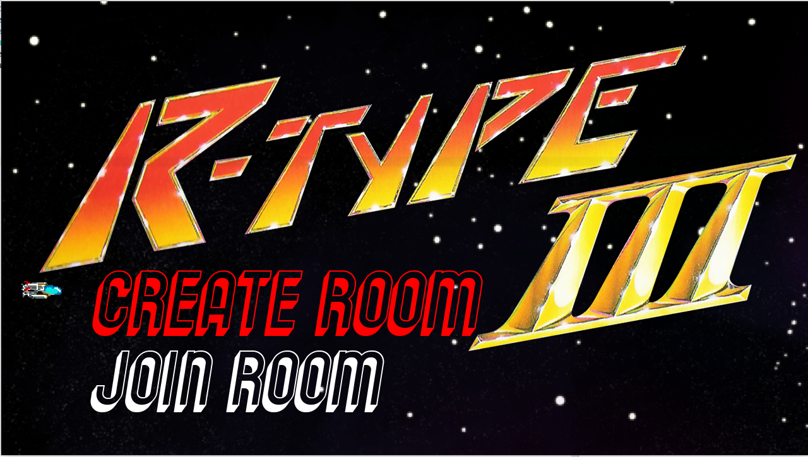
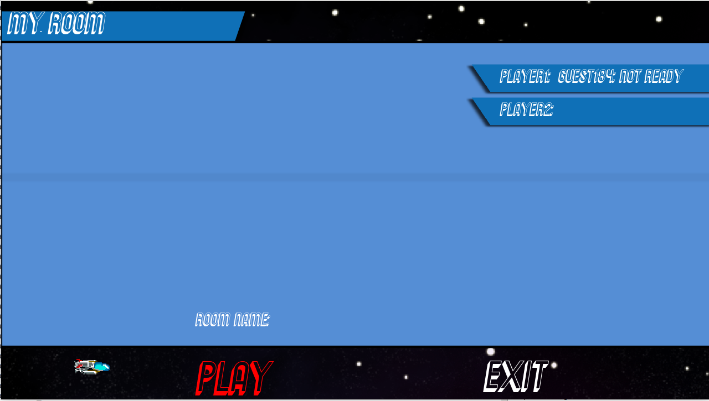
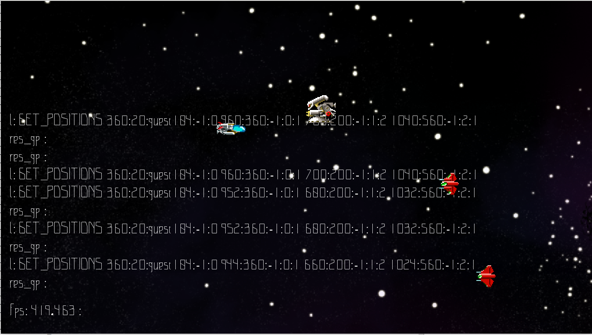

# RTYPE

[](https://travis-ci.org/joemccann/dillinger)

# Usage

#### Linux

```sh
$ ./setup.sh
$ cd build/
$ ./R-Type_Server
$ ./R-Type_Client
```
#### Windows

```sh
$ ./setup.sh
```

Launch solution file R-Type.sln with Visual Studio\n
Generate solution with realese x64 environement\n
Go to X64/realese directory\n
Launch R-Type Server and R-Type client\n

# Screen

### HomePage


### Join Server


### Create Room


### Room


### Game



License
----

MIT
